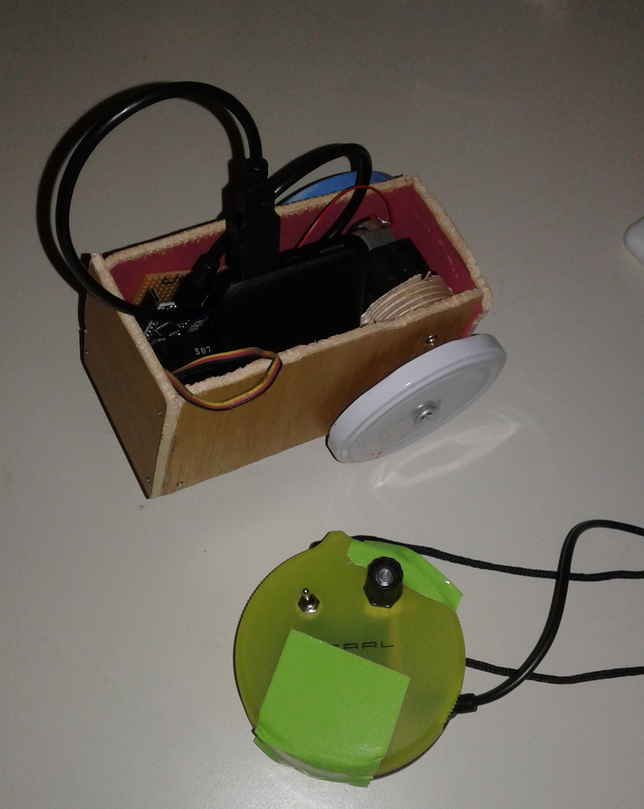
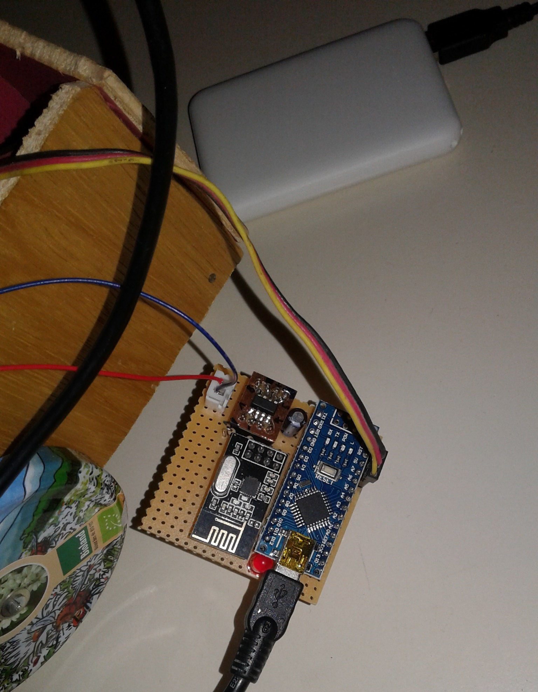

# Create a simple DIY remote controlled car



### What is this repository for? ###

* Quick summary  
	- RC and Car are bothed based on an arduino and will communicate via a wireless module (NRF24L01, 2.4GHz)
	- The RC (transmitter) looks for user input (Buttons,..) and send current state
	- The Car (receiver) reacts to received user input and set direction and speed of motor
	- Receiver and Transmitter are powered by a small USB Powerbank

## Firmware Setup ##
Too keep it simple, RC (transmitter) and the car (receiver) share the same arduino code.

- upload sketch to transmitter & receicer
```
#define TARGET_TRANSMITTER  1 //Remote Control
#define TARGET_RECEIVER     2 //Car

#define USED_TARGET TARGET_TRANSMITTER //<<< set target to be compiled
```
- check connection: if status LED flashes fast on receiver/transmitter there is no connection (motor stops if connection is lost)

## Hardware Setup ##

- Find schematics of transmitter and receiver in `...\RC-Transceiver\hardware\schematic`
- Find datasheets of used components in `...\RC-Transceiver\hardware\datasheet`

- `NRF24L01:` Transmitter and Receiver use same NRF pin setup. Find nice introduction here:  https://lastminuteengineers.com/nrf24l01-arduino-wireless-communication/

| Signal      | Arduino Pin    |
|---------------|-------|
| NRF_MOSI 		| 11    |
| NRF_MISO      | 12 	|
| NRF_MISO      | 13 	|
| NRF_CE      	| 7 	|
| NRF_CSN      	| 8 	|
| NRF_IRQ      	| N/A 	|

### Transmitter ###
- `Board:` Arduino nano (with USB-mini connector)
- `Supply:` 5V (USB Powerbank) via Arduino USB connector
- `NRF24L01:` Connect NRF supply pin to 3V, Arduino Pro Mini: "VCC"
- `Push Buttons:` connect other pin to ground (active low)
- `Status LED:` connect other pin to ground (active high)
- `Potentiometer:` connect upper pin to VCC, lower pin to gnd, add capacitor to gnd on middle pin

| Signal         	| Arduino Pin   |
|--------------		|--------		|
| LED_STATUS		|10     		|
| Pushbutton_1 		|2     			|
| Pushbutton_2 		|3     			|
| Poti_1			|0 (A0)			|

### Receiver ###
- `Board:` Arduino nano (with USB-mini connector)
- `Supply:` 5V (USB Powerbank) via Arduino USB connector
- `NRF24L01:` Connect NRF supply pin to 3V, Arduino Nano: "3V3"
- `Status LED:` connect other pin to ground (active high)
- `Servo:` connect supply pin to 5V
- `Motor Driver:` connect supply pin to 5V *(H-Bridge IC could be replaced by 2xNFET + 2xPFET)*
- `DC Motor:` Connect Motor pins to motor driver

| Signal        | Arduino Pin   |
|--------------	|--------		|
| LED_STATUS	|10     		|
| Servo1_Control|9     			|


| Signal       		| H-Bridge 	| Arduino Pin   |
|--------------		|--------	|--------------	|
| DCM1_GateP_neg	|G4			|3     			|
| DCM1_GateP_pos	|G1			|4     			|
| DCM1_GateN_neg	|G3			|5 (PWM) 		|
| DCM1_GateN_pos	|G2			|6 (PWM) 		|



## Mechanic Setup ##
### Transmitter ###
- A simple plastic box is used as RC housing
- Set direction of car: use potentiometer
- Move forward/backward: Use dual push switch (push&hold), idle position is stop

### Receiver ###
- As a car frame, wooden plates are nailed together (could be easily done by kids)
- As back wheels old metal caps are screwed to the axis (axis made of threaded standoff)
- Drive car forward and backward: Use single DC Motor to drive both back wheels (old DC motor with gears)
- Set direction of car: Use Servo to set angle of single front wheel (wheel is glued to the servo)